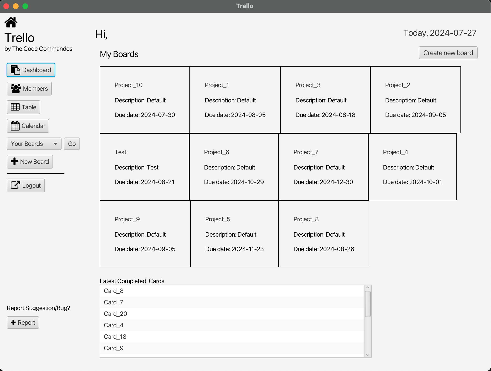

# Trello - by TheCodeCommandos



## Table of Contents

- [About](#about)
- [Features](#features)
- [Installation](#installation)
- [Database](#database)
- [Usage](#usage)
- [UI](#ui)
- [Contributing](#contributing)
- [License](#license)
- [Contact](#contact)

## About

This project is a task management application developed using JavaFX, inspired by Trello. It allows users to create, manage, and organize tasks in a visually intuitive manner.

## Features

- **User Authentication**: Sign up, log in, and log out functionality.
- **Task Management**: Create, edit, delete, and organize tasks.
- **Boards and Lists**: Create multiple boards and use lists to categorize tasks.
- **Move tasks between lists**: Move tasks within "To-do", "Doing", and "Done" through button.
- **Persistence**: Save tasks and boards locally using SQLite database.
- **Responsive UI**: User-friendly and responsive interface.

## Installation

### Prerequisites

- Java Development Kit (JDK) 8 or higher
- Apache Maven

### Steps

1. Clone the repository:

    ```bash
    git clone https://github.com/YuPeng1995/TheCodeCommandos.git
    ```

2. Navigate to the project directory:

    ```bash
    cd TheCodeCommandos
    ```

3. Build the project using Maven:

    ```bash
    mvn clean install
    ```

4. Run the application:

    ```bash
    mvn javafx:run
    ```

## Database

This application uses SQLite for data storage. The database file is created automatically in the project directory when the application is run for the first time.

### Database Schema

The database consists of the following tables:

- **Members**: Stores members information (ID, FirstName, LastName, Username, Password, Date).
- **Boards**: Stores board information (ID, BoardTitle, Description, Date).
- **Cards**: Stores task information (ID, CardName, Status, Date, Board).

## Usage

After starting the application, you can sign up for a new account or log in with an existing account. Once logged in, you can create new boards, and start adding tasks. Use button to move tasks between lists and organize your workflow.

## UI

This application uses FontAwesome for enhancing the UI with icons.

## Contributing

Contributions are welcome! If you have any ideas, suggestions, or bug reports, please open an issue or submit a pull request.

### Steps to Contribute

1. Fork the repository.
2. Create a new branch:

    ```bash
    git checkout -b feature/your-feature-name
    ```

3. Make your changes.
4. Commit your changes:

    ```bash
    git commit -m 'Add some feature'
    ```

5. Push to the branch:

    ```bash
    git push origin feature/your-feature-name
    ```

6. Open a pull request.

## License

This project is licensed under the MIT License - see the [LICENSE](LICENSE) file for details.

## Contact

- **TheCodeCommandos** - [peng.yu3@northeasten.edu](mailto:peng.yu3@northeasten.edu)
- **GitHub** - [YuPeng1995](https://github.com/YuPeng1995)

## Acknowledgements

- [JavaFX](https://openjfx.io/) - The toolkit used for building the UI.
- [SQLite](https://www.sqlite.org/index.html) - The database engine used for data storage.
- [Trello](https://trello.com/) - Inspiration for the project.

